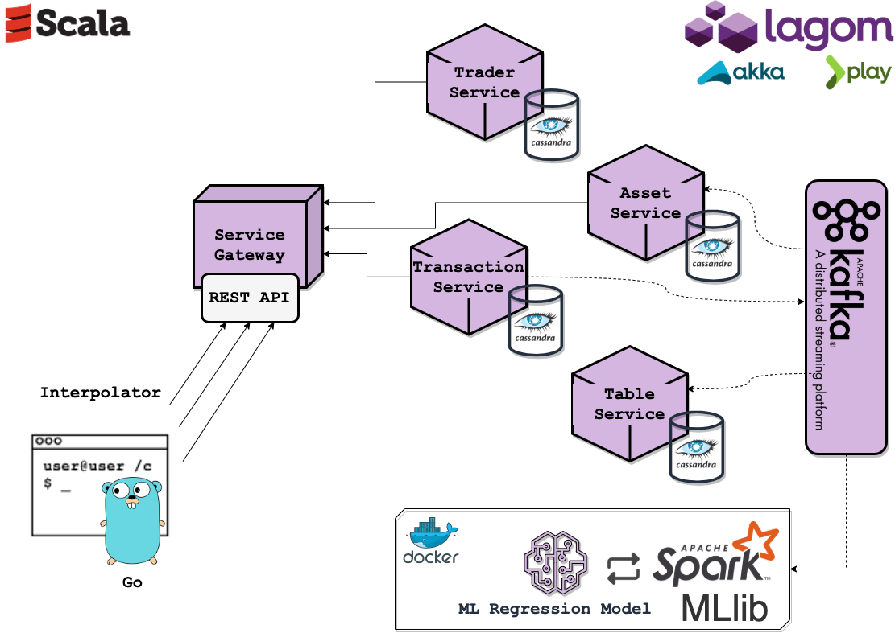
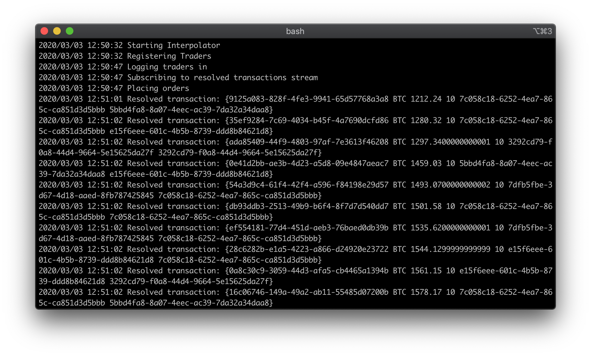
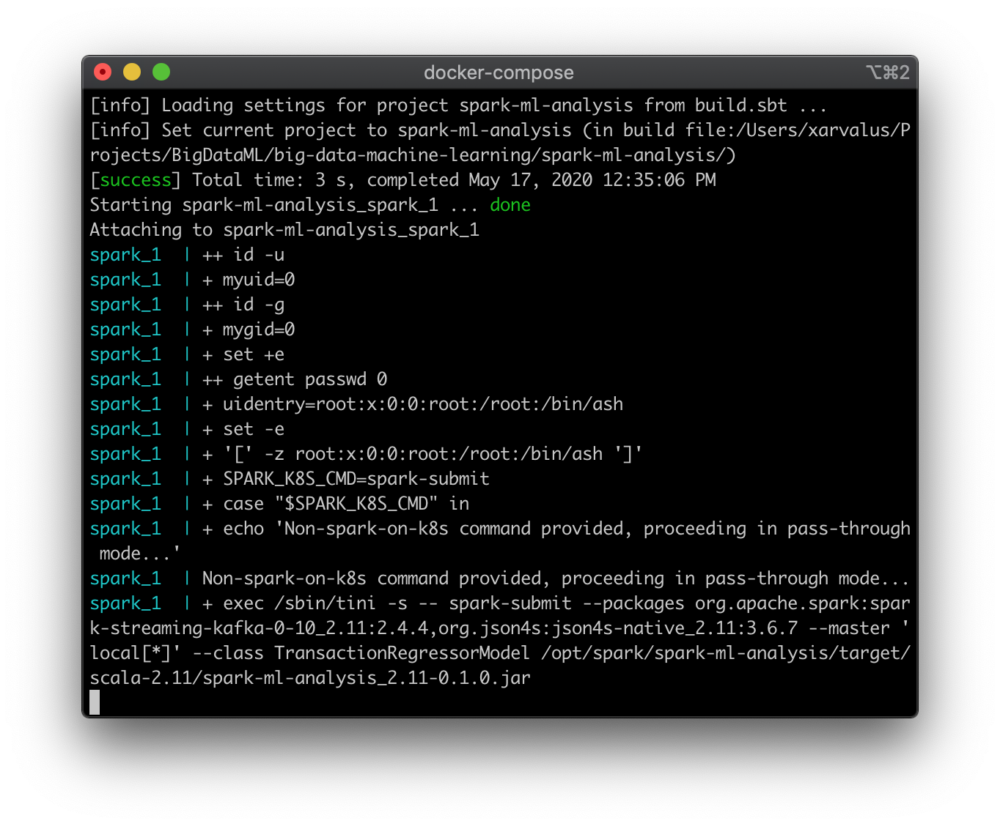

# reactive-stock

Reactive Lagom microservices (Akka) & Spark ML fast data analysis

Exploring capabilities to provide realtime online Big Data in operational applications with use of Machine Learning algorithms



### Architecture

- Scala reactive microservices build in Lagom (Akka / Actor Model) with Cassandra (NoSQL) for persisting
- Apache Spark / MLlib analytical part for realtime events processing from Apache Kafka
- Client-simulating interpolator build in Golang

Additionally Docker for virtualization of prototype

### Scenario

The prototype is simulating stock market trading with applied Machine Learning regression analysis in realtime thanks to streaming Fast Data

1) User registers with TraderService
2) User logs in
3) Interpolator (client) subscribes to stream of accomplished transactions
4) Making BUY / SELL transactions for assets in stock market based on interpolated data, distributed between many concurrent traders

Interpolator uses historical Bitcoin data to simulate some past situation which could be used for making ML predictions, the outcome can be compared with following historical data

### Development

The setup of project follows with Scala / sbt, Golang, Docker and Lagom dependencies

Useful commands:

```bash
make run        # start reactive system
make simulate   # run interpolator
make train      # build & train ML pipeline with Spark
make bash-spark # enter Spark console in Docker
make clean      # clean Kafka / Cassandra data
```

### Training ML model

Interpolator converting data for reactive system stock transactions



Realtime training based on events accessible in system via Kafka, it triggers re-training when errors level is too high


